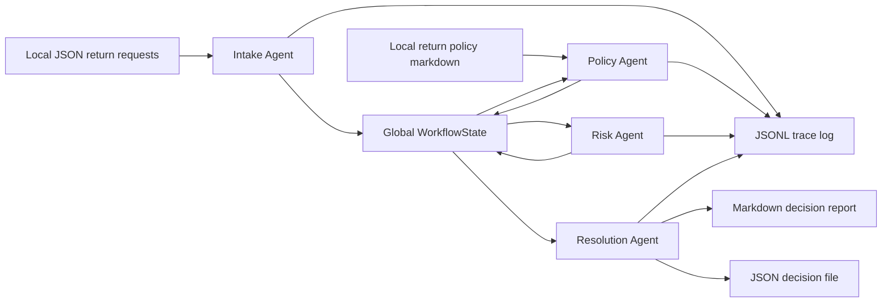

# Technical Report: ReturnWise MAS

SE4010 CTSE Assignment 2  
Project: Local Multi-Agent System for E-Commerce Return Triage  
Repository link: Add your GitHub link here after pushing.

## 1. Problem Domain

Online stores receive many return requests every day. Some are simple, such as an unused item returned inside the allowed window. Others need more care, such as damaged-on-arrival products, defective electronics, high-value used items, or customers with repeated return activity. A human support agent can handle this, but the work is repetitive and easy to make inconsistent when the request volume grows.

ReturnWise MAS was built to automate the first review of e-commerce return requests. The system does not replace a support team. Instead, it acts like a local decision-preparation team. It reads return requests from a file, checks each request against a local policy document, scores operational risk, and writes a final decision report that a support agent can review. This domain was chosen because it needs several separate reasoning steps, uses local files naturally, and has clear places for tool usage and evaluation.

The main goal is to show agentic AI architecture rather than a generic chatbot. The system has four agents with separate roles. Each agent receives and updates a shared global state. The agents also use custom Python tools instead of depending only on the language model's internal knowledge. All execution is local, and the Ollama integration uses a small local model such as `phi3`.

## 2. System Architecture

ReturnWise follows a sequential multi-agent workflow. The agents act as a small operations team:

1. The Intake Agent reads and validates raw requests.
2. The Policy Agent compares each request with the store's return policy.
3. The Risk Agent calculates internal risk signals.
4. The Resolution Agent produces final decisions and writes output files.

The orchestrator is implemented in `src/returnwise_mas/graph.py`. When LangGraph is installed, the workflow is compiled as a LangGraph `StateGraph`. A small sequential fallback is included so that tests can still run on a fresh machine before all optional dependencies are installed. In the actual project setup, LangGraph is the intended orchestration framework.



The workflow is local by design. Input data is stored in `sample_data/return_requests.json`, the policy is stored in `sample_data/return_policy.md`, logs are written to `logs/`, and final decisions are written to `outputs/`. No OpenAI, Anthropic, or paid cloud API key is needed.

## 3. Agent Roles and Responsibilities

### Intake Agent

The Intake Agent is responsible for turning raw request data into clean internal records. It uses `load_return_requests` to read the local JSON file and `normalize_return_request` to validate required fields, date format, order value, return count, item condition, and other basic fields.

System prompt summary:

> Normalize local return request data without inventing missing facts. Use only fields from the file. Flag missing or suspicious fields instead of guessing.

This prompt is intentionally strict because small language models can hallucinate if asked to "complete" missing business data. The agent is not allowed to fill blanks from imagination. Its reasoning logic is simple: first check structure, then convert types, then add an operational note to the shared state.

### Policy Agent

The Policy Agent reads the local markdown policy and matches each request against policy rules. It uses `read_policy_text` and `match_policy`. The tool checks windows for standard returns, apparel, defective items, damaged-on-arrival items, and electronics.

System prompt summary:

> Compare each request with the local policy file. Do not use general retail knowledge. Use the policy text and calculated dates only.

This keeps the agent grounded. The policy file is the source of truth, not the model's memory. The Policy Agent updates the global state with `policy_matches`, including eligibility, days since purchase, window days, policy reason, and a suggested status.

### Risk Agent

The Risk Agent scores operational risk. It does not accuse customers or make final customer-facing decisions. It uses `calculate_risk_score`, which considers recent return volume, item value, item condition, and policy eligibility.

System prompt summary:

> Score abuse, fraud, and operational risk. Do not accuse the customer. Explain risk as internal operational signals.

The scoring range is 0 to 100. Scores below 25 are low risk, 25 to 59 are medium risk, and 60 or above is high risk. High risk requests are escalated later by the Resolution Agent.

### Resolution Agent

The Resolution Agent brings the previous outputs together. It uses `build_decision` to create a final status and `write_decision_outputs` to save markdown and JSON reports.

System prompt summary:

> Synthesize policy and risk findings into final support decisions. Customer messages must be polite and clear. Escalations must explain the next internal action.

The final statuses are `approve`, `replace`, `escalate`, and `reject`. This agent writes both a customer-friendly message and an internal reason, because support staff need both.

## 4. Interaction Strategy

The interaction strategy is a controlled pipeline rather than a free conversation. This was a deliberate engineering choice. Return triage has a natural order: data must be valid before policy can be applied, policy must be known before risk can be interpreted, and final decisions should only happen after both policy and risk have been calculated.

Each agent receives the same `WorkflowState` object and adds its own output. No agent directly edits another agent's result. This reduces responsibility overlap and makes debugging easier. The state also makes the handoff visible. For example, the Risk Agent does not reread the original files. It uses the normalized requests and policy matches already placed in state by earlier agents.

Ollama is used through `src/returnwise_mas/ollama_client.py`. The local model is asked for short audit notes and message checks, while the business-critical calculations stay inside deterministic tools. This balance is important. It shows local SLM use, but keeps policy windows, risk scores, and file writing reliable and testable.

## 5. Custom Tools

The project includes several custom Python tools in `src/returnwise_mas/tools.py`. The tools use type hints, docstrings, and explicit error handling.

| Tool                       | Used by          | Purpose                                                          |
| -------------------------- | ---------------- | ---------------------------------------------------------------- |
| `load_return_requests`     | Intake Agent     | Reads local JSON request files.                                  |
| `normalize_return_request` | Intake Agent     | Validates required fields and converts values to expected types. |
| `read_policy_text`         | Policy Agent     | Loads the local markdown policy file.                            |
| `match_policy`             | Policy Agent     | Applies policy windows and status suggestions.                   |
| `calculate_risk_score`     | Risk Agent       | Produces a 0 to 100 risk score and internal flags.               |
| `build_decision`           | Resolution Agent | Creates final support decisions.                                 |
| `write_decision_outputs`   | Resolution Agent | Writes markdown and JSON output files.                           |

Example tool usage:

```python
policy_text = read_policy_text("sample_data/return_policy.md")
policy_match = match_policy(request, policy_text)
risk = calculate_risk_score(request, policy_match)
decision = build_decision(request, policy_match, risk)
```

The tools are intentionally local. They read files, parse data, calculate dates, and write reports without any paid cloud services.

## 6. State Management

Global state is defined in `src/returnwise_mas/state.py` as a typed dictionary called `WorkflowState`. The important fields are:

| State field        | Meaning                                               |
| ------------------ | ----------------------------------------------------- |
| `run_id`           | Unique id for the execution.                          |
| `input_path`       | Local JSON file path.                                 |
| `policy_path`      | Local policy file path.                               |
| `log_path`         | JSONL trace file for this run.                        |
| `requests`         | Normalized request records from the Intake Agent.     |
| `policy_matches`   | Policy outputs from the Policy Agent.                 |
| `risk_assessments` | Risk outputs from the Risk Agent.                     |
| `decisions`        | Final outputs from the Resolution Agent.              |
| `agent_notes`      | Short audit notes written by agents.                  |
| `errors`           | Validation or runtime errors that should be reviewed. |

This structure prevents context loss. Each agent can see what earlier agents produced, and the final state can be inspected after execution. It also makes testing direct because the evaluation harness can assert against structured state fields instead of reading unstructured console output.

## 7. Observability and AgentOps

Observability is handled by `AgentRunLogger` in `src/returnwise_mas/observability.py`. It writes append-only JSONL records. Each record includes a timestamp, event type, agent name, and payload.

The log captures:

- Agent start events
- Agent end events
- Tool calls
- Tool results
- Ollama errors if the local model is unavailable

This is useful for debugging and grading because the lecturer can see exactly which tools were called and what each agent produced. It also supports basic AgentOps thinking: when a result looks wrong, we can inspect whether the issue came from input data, policy matching, risk scoring, or final resolution.

## 8. Evaluation Methodology

The project has both unit tests and a group-level evaluation harness.

Unit tests are stored in:

- `tests/test_tools.py`
- `tests/test_agents.py`

The group evaluation script is:

- `tests/evaluation_harness.py`

The evaluation harness runs the full workflow with `enable_llm=False`. This makes the evaluation deterministic and avoids failing just because Ollama is not running during automated checks. The system itself still supports Ollama for the actual local demo.

The evaluation checks:

- The workflow produces four decisions for the four sample requests.
- Each decision has a valid status.
- Customer messages are present.
- Risk scores stay between 0 and 100.
- Paid API keys are not required.
- Output files and trace logs are created.

Reliability was improved by keeping business rules inside tools. The SLM is used for audit notes and wording support, while the actual policy and risk decisions are deterministic and testable. This reduces hallucination risk and makes the system more suitable for local small language models.

## 9. Individual Contribution Proof

This submission was completed by a single contributor.

| Student                | Agent developed                                          | Tool implemented                                                                                                                                           | Test contribution                                                    | Challenges faced                                                                         |
| ---------------------- | -------------------------------------------------------- | ---------------------------------------------------------------------------------------------------------------------------------------------------------- | -------------------------------------------------------------------- | ---------------------------------------------------------------------------------------- |
| Abishek S (IT22186942) | Intake Agent, Policy Agent, Risk Agent, Resolution Agent | `load_return_requests`, `normalize_return_request`, `read_policy_text`, `match_policy`, `calculate_risk_score`, `build_decision`, `write_decision_outputs` | Missing field, validation, policy, risk, and end-to-end output tests | Completing the full pipeline alone while keeping the system deterministic and auditable. |

The single contributor also validated the workflow with `tests/evaluation_harness.py` and the unit test suite. Each agent has at least one specific assertion connected to its output.

## 10. How to Run

Install the dependencies:

```bash
pip install -e .
```

Start Ollama and pull a model:

```bash
ollama pull phi3
ollama serve
```

Run the MAS:

```bash
python -m returnwise_mas --input sample_data/return_requests.json --policy sample_data/return_policy.md
```

Run deterministic evaluation:

```bash
python tests/evaluation_harness.py
```

Run all tests:

```bash
python -m unittest discover -s tests -p "test_*.py"
```

## 11. Conclusion

ReturnWise MAS demonstrates a complete local multi-agent workflow. It has four agents, custom tools, shared state, logging, testing, and local Ollama integration. The design avoids the common weakness of chatbot-style projects by giving each agent a concrete responsibility and by making the tools do real work with local files.

The strongest part of the system is that it is auditable. A support decision can be traced back through normalized input, policy match, risk assessment, and final resolution. That makes the project practical for the assignment and also realistic as a small internal operations prototype.
